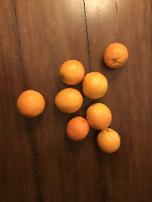
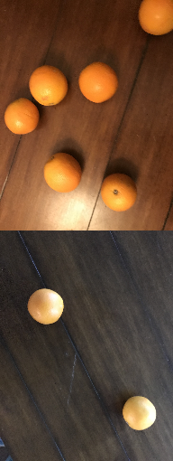
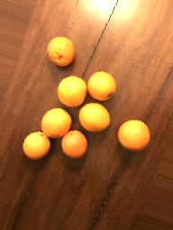
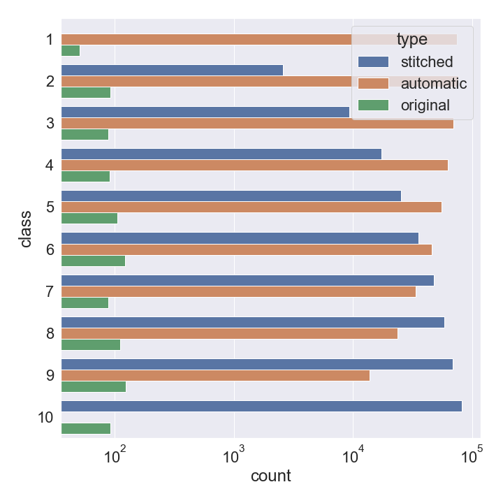

# Table of Contents
1. [Motivation](#motivation)
2. [Data Augmentation Methods](#augmentation)
3. [Results](#results)

## Motivation 
In this project, we are interested in building a neural network model that counts the number of objects in a picture. 
The user can gather their own images with a cell phone and augment them with the pipeline discussed in this project. Currently, we have focused 
on oranges in a relatively plain background. The project can be extended to incorporate more complex backgrounds and 
mixture of objects. 

## Data Augmentation Methods 
Our project addresses an image classification task with 10 classes. We start with about 100 cellphone images that we have gathered 
for each class (Figure 1a). The initial dataset is extremely insufficient for the model to detect the differences
between 3 versus 4 oranges in a picture. To remediate this deficiency, we first conduct a "manual" augmentation technique
by stitching two images together and placing it in the appropriate class (Figure 1b). For instance, if we stitch an image from class 1
with an image from class 3 we end up with a new image in class 4. The manual augmentation will naturally result in 
an imbalanced dataset, with higher number classes containing more images (for example, there are more permutations to create class 10 
than there are for class 2). 

We subsequently compensate for the class imbalance by creating additional images using an "automatic" approach. The automatic approach 
comprises of image rotation, brightness manipulation, image flipping, and shearing (Figure 1c). The advantage of the manual method is that, once image
sizes are standardized, it gives the model cases with different orange sizes in a picture to learn. It furthermore, does not rely on 
image manipulation rules that the model can potentially pick up on when building  a large dataset.

Figure 1:Image of oranges for class 8: original (a-left), manual (b-middle), automatic (c-right).

Figure 2: Count bar for the final dataset. Notice that class imbalanced has been compensated with automatic image generation.