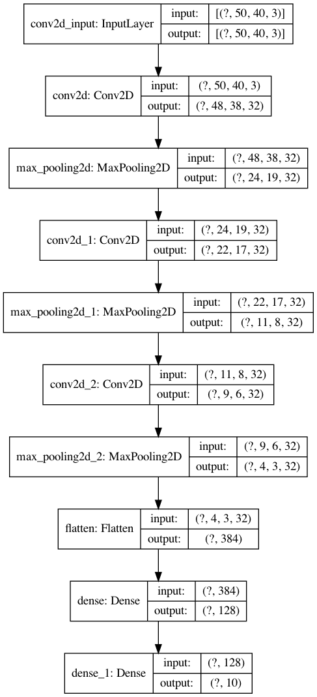

# Table of Contents
1. [Motivation](#motivation)
2. [Data Augmentation Methods](#augmentation)
3. [Model Description](#model_description)
4. [Results](#results)
5. [Conclusions](#conclusions)

## Motivation 
In this project, we are interested in building a neural network model that counts the number of objects in a picture. 
The user can gather their own images with a cell phone and augment them with the pipeline discussed in this project. Currently, we have focused 
on oranges in a relatively plain background as an example. The project can be extended to incorporate more complex backgrounds and 
mixture of objects. 

## Data Augmentation Methods 
Our project addresses an image classification task with 10 classes. We start with about 100 cellphone images
for each class (Figure 1a). The initial dataset is extremely insufficient for building a neural network model. To remediate this deficiency, we first conduct a "manual" augmentation technique
by stitching two images together and placing it in the appropriate class (Figure 1b). For instance, if we stitch an image from class 1
with an image from class 3 we end up with a new image in class 4. The manual augmentation will naturally result in 
an imbalanced dataset, with higher number classes containing more images (for example, there are more permutations to create class 10 
than there are for class 2). 

We subsequently compensate for the class imbalance by creating additional images using an "automatic" approach. The automatic approach 
comprises of image rotation, brightness manipulation, image flipping, and shearing (Figure 1c). The advantage of the manual method is that, once image
sizes are standardized, it gives the model cases with different orange sizes in a picture. It furthermore, does not rely on 
image manipulation rules that the model can potentially pick up on when building  a large dataset.

Figure 1: Images of oranges for class 8: original (a-left), manual (b-middle), automatic (c-right).

Figure 2: Count bar for the final dataset. Notice that class imbalanced has been compensated with automatic image generation.

## Model Description 
We build a a shallow neural network model (Figure 3) that comprises of three convolutional layers followed up
by max pooling to capture the most distinct elements in each feature map. The parameters are then flattened and 
reduced in dimensionality to an array of 10 (number of classes). We use Adam optimizer and a sparse categorical
cross entropy (as our classes are mutually exclusive).

Figure 3: Visualization of model architecture.

## Results 
We visualize the model's training and validation accuracy by plotting confusion matrices for both datasets (Figure 4).
The training confusion matrix demonstrates considerable consistency for the accuracy of each class. This is in contrast
to the confusion matrix of the validation set that where, model's accuracy drops as number of oranges drops. A peculiar
mismatch is class 2 where all images are misclassified as class 10. I couldn't discover similarities between class 2 and class 10,
and despite running the model repeatedly and obtaining the same misclassification, I am left to determine that this issue
is due to model's inherent bias with the current dataset. 

 

Figure 4: Confusion matrices for training (a-left) and validation (b-right) sets.

The history of the model's training is shown in Figure 5. We observe that the training accuracy is excellent even
in the first epoch whereas the validation accuracy drops from 70% to just above 60%. The model therefore demonstrates considerable
overfitting. However, reducing the model's complexity (using a shallower network with smaller number of parameters), droping out
parameters in a layer, and using a regularization parameter did not improve the validation accuracy above 70%.

Figure 5: History of training and validation loss and accuracy for various counter measures.

Figure 6 shows the activation filters for the first layer. We notice that the kernel appears to detect
the light gradient across all directions uniformly, which is consistent with our random data acquisition.
In Figure 7 we see that layers tend to capture image properties from foreground to background as they go deeper. Where the
first layer attempts to capture the finer image properties related to the oranges and the last
layer focuses on coarser and relatively background-related properties. That said, interpreting 
activation filters and feature maps are generally difficult and the plotting is done to obtain qualitative
insights on the model's training.

Figure 6: Activation filter visualization.

   

Figure 7: Feature map visualization. Notice that we have reduced the resolution of images to reduce computational overload. Interestingly,
the reduction of resolution did not incur considerbale bias to our model.  

## Conclusions 
We demonstrate that through a combination of manual and automatic data augmentation, accuracy of training and 
validation set can go up to X%. This is in contrast to a purely automatic augmentation method where the 
accuracy increases to x%. Future work will include an examination of non-ideal backgrounds and mixture of objects
of different kinds. 
